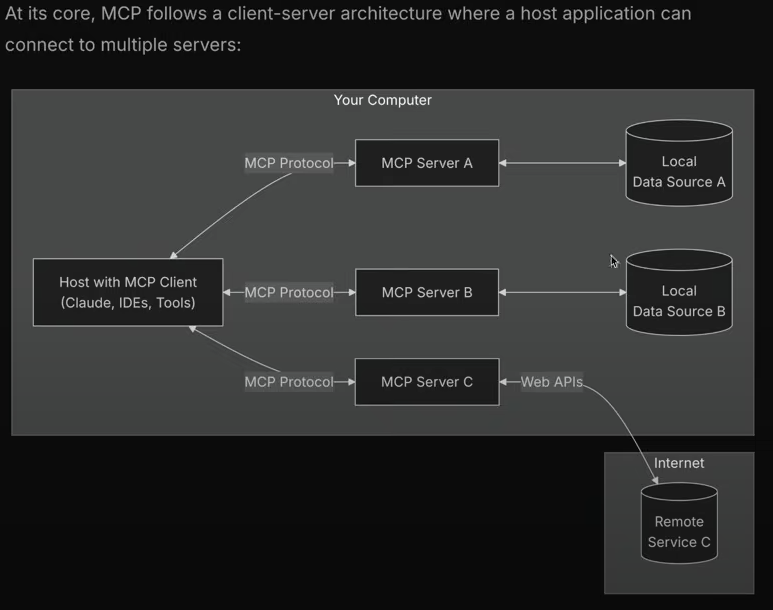

# Model Context Protocol (MCP)

**model** – LLM  
**context** – extra, external information  
**protocol** – rules

The context window of an LLM is limited, and LLMs are trained on vast datasets, typically only once a week or day, so they are not always up to date. **MCP** is a way to provide context to an LLM efficiently. It offers a standardized method to connect AI models to data sources and tools.

## General Architecture



Unlike typical HTTP servers that listen on a port, **MCP servers** operate over stdio (standard input/output), directly printing to the terminal.

### Example Interaction

**LLM sends request to MCP server via standard input:**

```bash
echo '{"method": "tools"}'
```

**MCP server responds via standard output:**

```bash
echo '{"tools": ["weather", "todo"]}'
```

The response can be captured and processed (e.g., using `console.log()`) so it can be read by the LLM.

## Key Components

- **MCP Host** – The AI application that coordinates and manages one or multiple MCP clients.
- **MCP Client** – Maintains a connection to an MCP server and obtains context for the MCP host.
- **MCP Server** – Provides context to MCP clients.

## How to create **MCP server** ?

1. `npm install @modelcontextprotocol/sdk`

2. `npm i zod` -- for validations of input parameter

3. Now create an index.js file :

```bash
import { McpServer} from "@modelcontextprotocol/sdk/server/mcp.js";
import { z } from "zod";

// Create an MCP server
const server = new McpServer({
  name: "demo-server",
  version: "1.0.0"
});

async function getWeatherByCity(city='') {
   if (city.toLowerCase()==="Delhi") {
    return {temp: '30C', forecast: 'chances of high rain'};
   }

   return {temp: 'none', error: 'unable to fetch data'};
}

server.registerTool("getWeatherDataByCityName",
  {
    city: z.string(),
  },
  async ({ city }) => {
    return { content: [{ type: 'text', text: JSON.stringify(await getWeatherByCity(city)) }] };
  }
);

// or this city: z.string() instead of this another way is like below:

// Add an addition tool

// server.registerTool("add",
//  {
//    title: "Addition Tool",
//    description: "Add two numbers",
//    inputSchema: { a: z.number(), b: z.number() }
//  },
//  async ({ a, b }) => ({
//    content: [{ type: "text", text: String(a + b) }]
//  })
// );

async init() {
// Start receiving messages on stdin and sending messages on stdout

const transport = new StdioServerTransport();
await server.connect(transport);
}

init();

```

## Transports

The protocol currently defines two standard transport mechanisms for client-server communication:

1. **stdio**, communication over standard in and standard out : particularly useful for local integrations and command line tools.
2. **Streamable HTTP** here the server operates as an independent process that can handle multiple client connections thorugh sse server sent events.

> Through sse we can make remote mcp servers like express ones hosted on our doamin which can listen mutiple requests.
