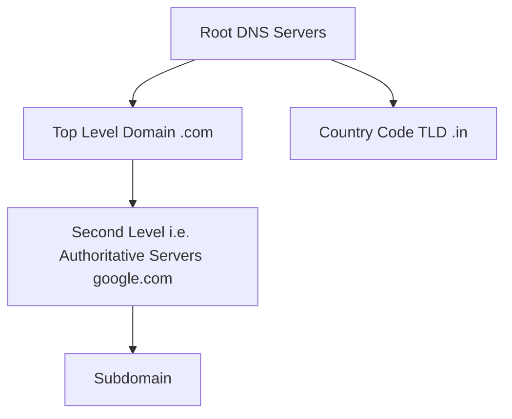
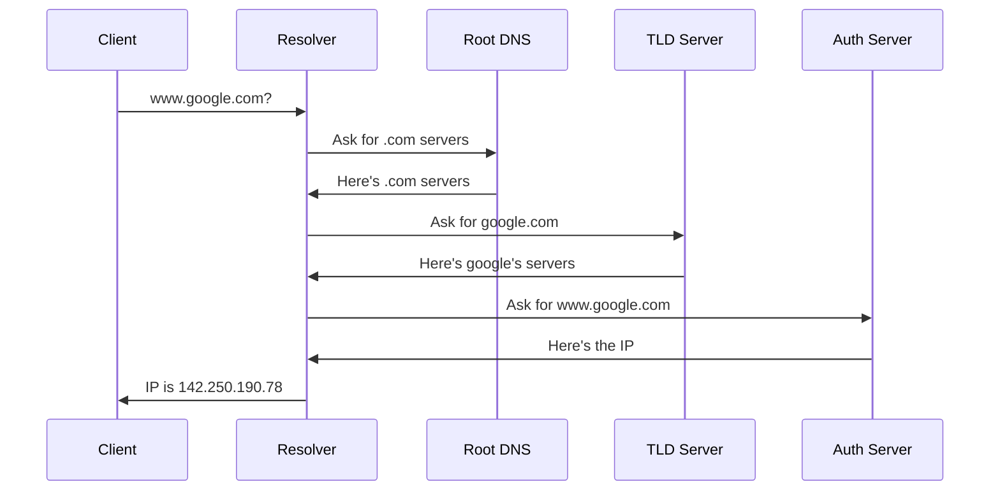
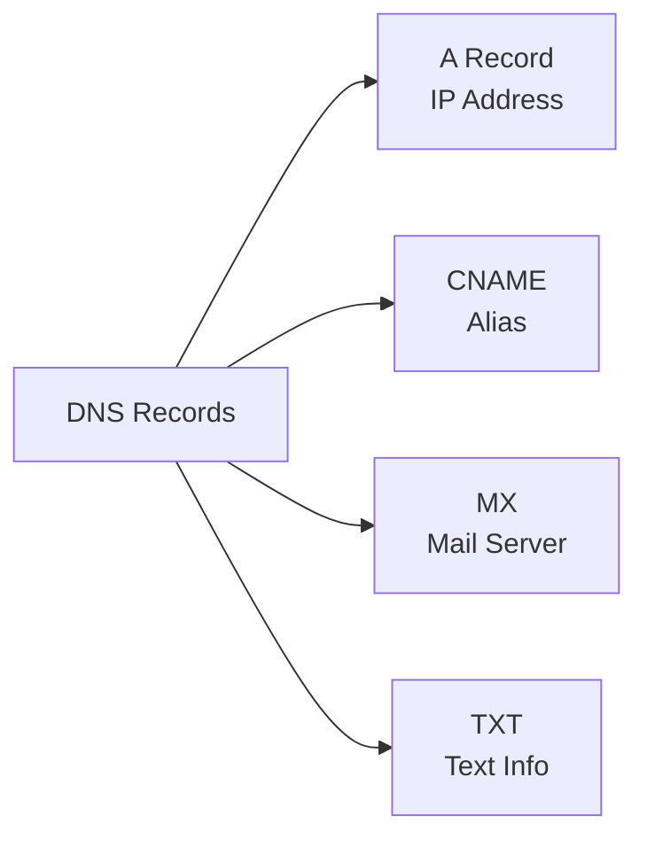

# Domain Name System (DNS)

## What is DNS?

DNS is like the internet's phone book - it converts human-readable domain names (www.google.com) into IP addresses (142.250.190.78).

## DNS Hierarchy

- www.google.com is a subdomain of google.com even if www is removed it will work fine , it was required previously to separate web traffic from other like mail etc.

## DNS Resolution Process

-- **Root Name Server Directs to TLD Server**

- The Root Name Server doesn’t know the exact IP but knows where to look.
- It tells the LNS to ask the Top-Level Domain (TLD) Server for .com.

## Types of DNS Servers

**1. DNS Resolver (Recursive) : Local Name Server (LNS)**

- The LNS (provided by your ISP or network) checks if it already knows the IP address.

- First point of contact
- Handles client requests
- Caches results
- Example: ISP's DNS server

**2. Root Name Servers (.)**

- Top of DNS hierarchy
- 13 root server clusters
- Points to TLD servers

**3. TLD Servers (.com, .org, .net)**

- Manages top-level domains
- Points to authoritative servers
- Example: Verisign for .com

**4. Authoritative Name Servers**

- Final source of truth
- Holds actual DNS records
- Example: Google's DNS servers

## DNS Records

- **Host Aliasing**

  What it does: Allows a single domain name to point to multiple other names or addresses.

  Why it’s needed: Helps manage multiple services under one name.

Example: Canonical Name (CNAME): www.example.com

Alias Names: shop.example.com, blog.example.com, etc.

- **Mail Server Aliasing**

  What it does: Redirects email traffic to the right mail servers.

  Why it’s needed: Email servers often have different names from websites.

  DNS uses MX (Mail Exchange) records to find the correct mail server.

## Example: Visiting www.google.com

1. Check browser cache
2. Check OS cache
3. Check resolver cache
4. Ask root servers
5. Ask .com servers
6. Ask Google's servers
7. Get IP address
8. Cache result
