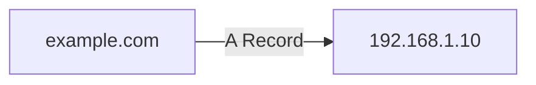
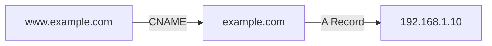
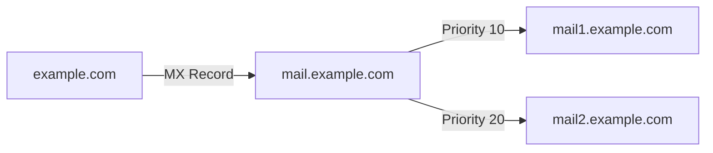
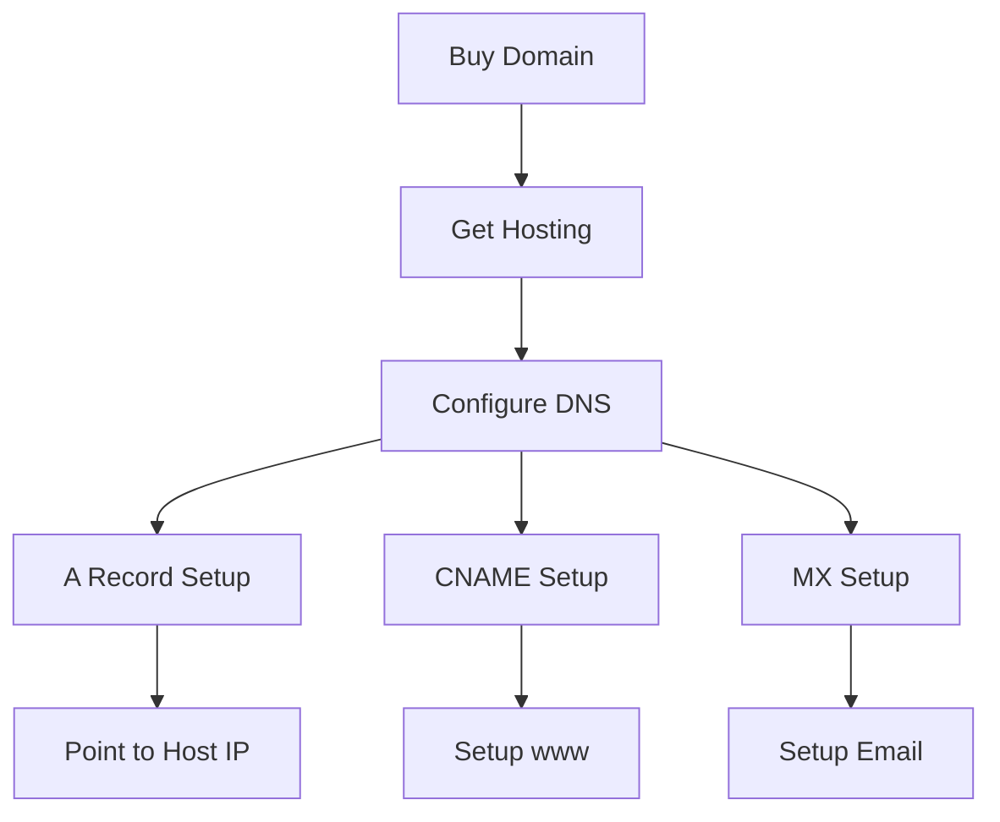
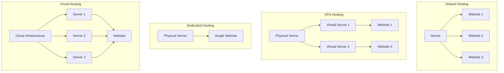

# Web Hosting & DNS Records

## DNS Records Explained

1. **A Record (Address)**



- Points domain to IP address
- Direct connection
- Fast resolution
- Example: `example.com → 192.168.1.10`

2. **CNAME (Canonical Name)**



- Points domain to another domain
- Like an alias
- Flexible but slower
- Example: `www.example.com → example.com`

3. **MX Record (Mail Exchange)**



- Email routing
- Multiple servers
- Priority based
- Example: `example.com → mail1.example.com (10)`

4. **TXT Record (Text)**

- SPF records
- DKIM verification
- Domain verification
- Example: `v=spf1 include:_spf.google.com ~all`

## Real-World Example: Website Setup



## Common Configurations

1. **Basic Website**

```
example.com       A     192.168.1.10
www.example.com   CNAME example.com
```

2. **Email Setup**

```
example.com       MX    mail.example.com (10)
mail.example.com  A     192.168.1.20
```

3. **Subdomain Setup**

```
blog.example.com  A     192.168.1.30
shop.example.com  A     192.168.1.40
```

## Best Practices

- Use A records for apex domain
- Use CNAME for subdomains
- Set appropriate TTL
- Regular DNS audits
- Backup DNS records

---

## Types of Hosting


