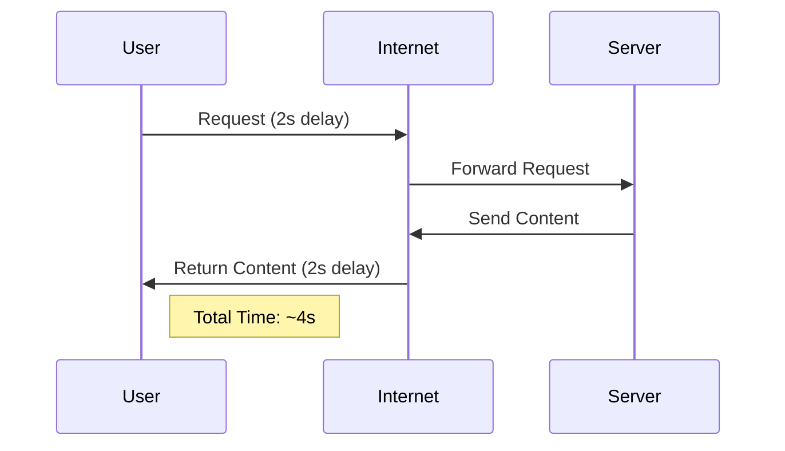
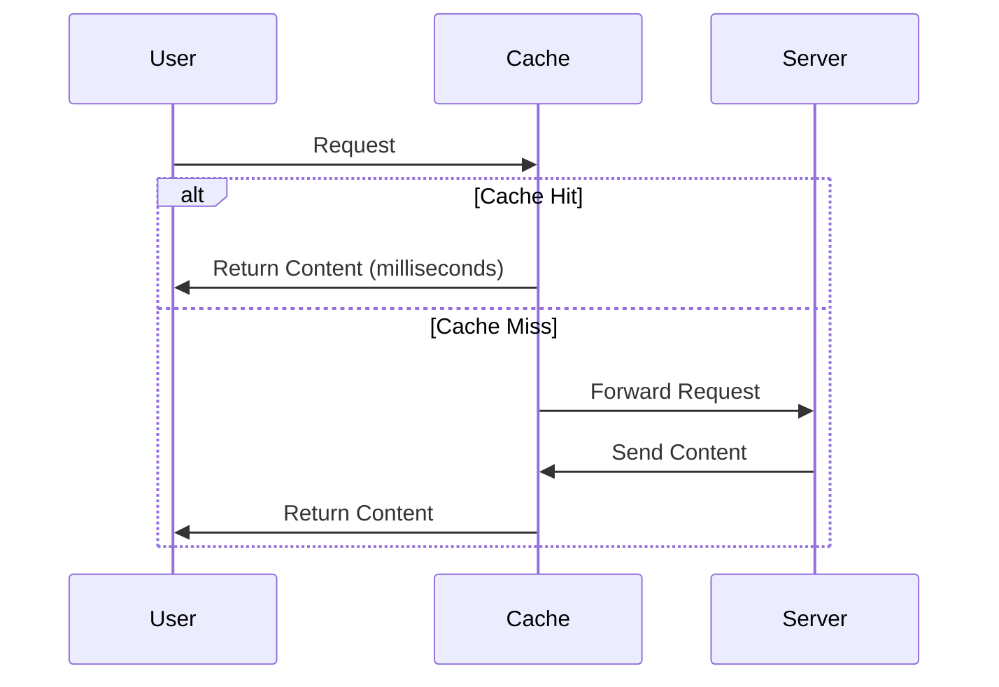
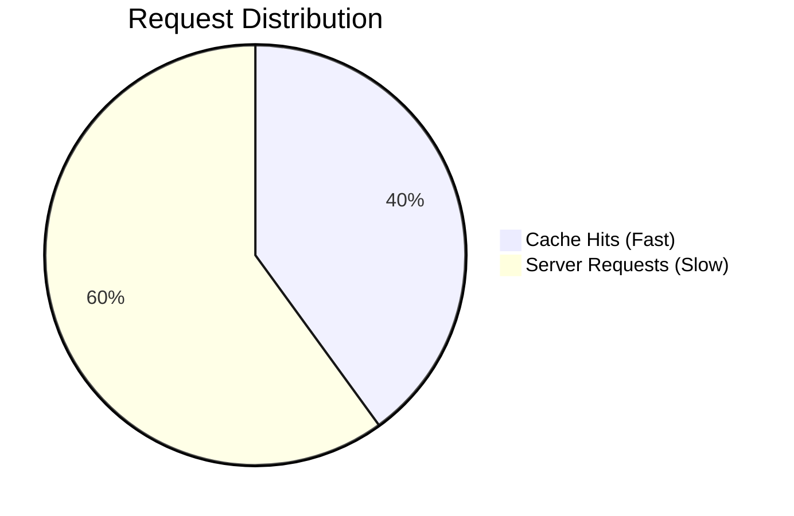
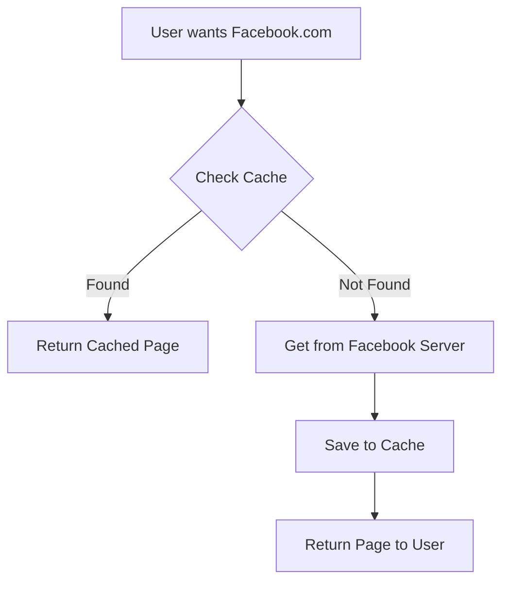

# Web Caching Explained

## What is Web Caching?

A web cache (proxy server) sits between your browser and the internet. It saves copies of web pages and files so that future requests for the same data load faster without contacting the original server.

## Types of Proxy Servers

🔹 Forward Proxy → Sits between users and the internet (e.g., used in offices & schools).

- Hiding your real IP address.
- Bypassing website restrictions (e.g., if YouTube is blocked in school).

🔹 Reverse Proxy → Sits between users and a web server (used by websites to manage traffic).

- Website security → Hides the real web server to protect against hackers.
- Load balancing → Distributes traffic across multiple servers to prevent crashes.
- Caching → Stores website content for faster loading.

### When to Use a Proxy?

- If you just want to bypass website restrictions (e.g., school blocks YouTube).
- If you don’t care about encryption but want a different location.

### When to Use a VPN?

- If you want privacy & security (e.g., protecting personal data on public WiFi).
- If you want to bypass geo-restrictions (e.g., watching Netflix US from another country).

## Approach

First, let's understand the key components of a web caching problem:

- Request rate (λ) from the institution
- Object size
- Link capacities (LAN and access link)
- Internet delay
- Cache hit rate (if cache is used)

Basic Performance Metrics:

- **Utilization (ρ)** = Arrival rate × Average service time = Traffic Intenstiy
- **Service rate (μ)** = Link capacity / Object size
- **Average response time** = Internet delay + Access link delay + LAN delay

**For M/M/1 queues, use the formula E[T] = 1/(μ-λ) for access delay.**

**Note:** If cache is present : Hit rate = x ; ex: x= 0.4

- Average delay = 0.4 × (cache delay) + 0.6 × (Internet delay + access delay)

### Example

- Service rate (μ) = Link capacity / Object size = 100 Mbps / 1 Mbit = 100 requests/second

- Arrival rate (λ) = 15 requests/second (given in problem)

- Traffic intensity (ρ) = λ/μ = 15/100 = 0.15 = 15%

---

## Without Cache vs With Cache

### Scenario 1: No Cache

### Scenario 2: With Cache

### Example Calculation

#### Given Data:

- Request Rate: 15 requests/second
- Object Size: 100,000 bits
- Internet Delay: 2 seconds
- Cache Hit Rate: 40%

#### Results With Cache:

