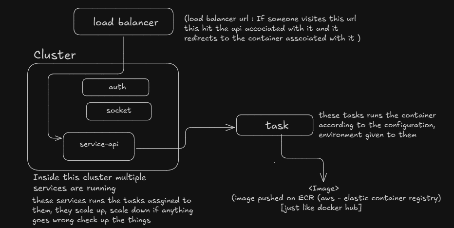
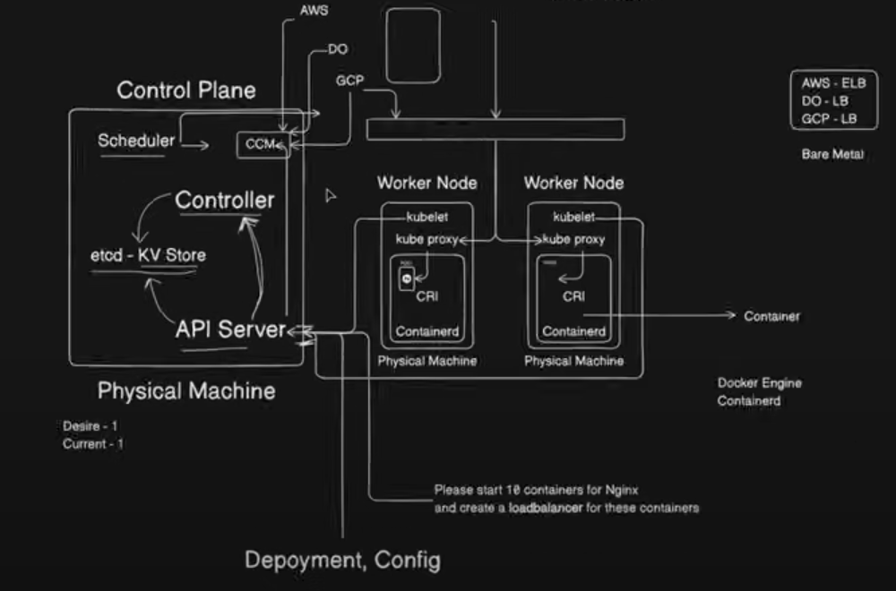

## Docker

Docker is a tool that packages your app and everything it needs into one small, portable unit called a "container."

That container can run anywhere — your laptop, a server, AWS, Google Cloud, etc. — and it will behave the same.

**_It is the building block of kubernetes :)_**

- **Docker Image :** A Docker Image is a template or blueprint of your app. It includes your app code, dependencies, and environment

- **Docker Container :** A Docker Container is a running instance of a Docker Image. It’s the actual live app, isolated and self-contained, running on your machine or server.

### Common Docker Commands

- `docker run -it <image_name>`  
   Start a new container from an image and attach your terminal to it interactively.

- `docker exec -it <container_name> <command>`  
   Run a command inside a running container (e.g., open a shell with `bash`). Here -it is for interactive if removed it will show the result of the command and get back to your terminal

- `docker container ls`  
   List currently running containers.

- `docker container ls -a`  
   List all containers (including stopped ones).

- `docker start <container_name>`  
   Start a stopped container.

- `docker stop <container_name>`  
   Stop a running container.

- `docker images`  
   List all Docker images on your system.

- `docker run -it -p <host_port>:<container_port> <image_name>`  
   Start a new container, map a port from your machine (`host_port`) to the container (`container_port`), and attach your terminal interactively. Useful for exposing web servers or APIs running inside the container.
- `docker run -it -p <host_port>:<container_port> -e key=value -e key=value <image_name>`  
   Start a new container, map a port, and set environment variables (`-e key=value`). You can specify multiple `-e` flags to pass different environment variables into the container.

---

### Creating a Docker Image for Your Application

To containerize your Node.js application, create a file named `Dockerfile` in your project directory. Here’s a sample `Dockerfile`:

```dockerfile
FROM ubuntu

RUN apt-get update
RUN apt-get install -y curl
RUN curl -sL https://deb.nodesource.com/setup_18.x | bash -
RUN apt-get upgrade -y
RUN apt-get install -y nodejs

WORKDIR /app

COPY package.json package.json
COPY package-lock.json package-lock.json
COPY main.js main.js

RUN npm install

ENTRYPOINT [ "node", "main.js" ]
```

_Instead of copying you can use `COPY . .` it will copy all files from the current folder and if you want to ignore some of them put them in `.dockerignore`_

**Explanation:**

- `FROM ubuntu`  
   Uses Ubuntu as the base image (your app will run on Ubuntu inside the container).

- The `RUN` commands  
   Install Node.js and its dependencies on Ubuntu.

- `COPY`  
   Copies your application files into the container.

- `RUN npm install`  
   Installs your Node.js dependencies.

- `ENTRYPOINT`  
   Specifies the command to run when the container starts (`node main.js`).

**To build the image:**

```sh
docker build -t my-node-app .
```

here -t means tag and . is the path you can specify it where your dockerfile is present in the folder

**To push this image to docker hub**

```sh
docker push
```

**To run the container:**

```sh
docker run -it my-node-app
```

---

### Managing Multiple Containers with Docker Compose

When your application relies on multiple services (like a Node.js app with Postgres and Redis), you can manage all containers together using **Docker Compose**. Docker Compose lets you define and run multi-container Docker applications using a simple YAML file called `docker-compose.yml`.

Here’s a sample `docker-compose.yml` for a Node.js app with Postgres and Redis:

```yaml
version: "3.8"
services:
  app:
    build: .
    ports:
      - "3000:3000"
    environment:
      - NODE_ENV=development
    depends_on:
      - db
      - redis

  db:
    image: postgres:15
    environment:
      - POSTGRES_USER=myuser
      - POSTGRES_PASSWORD=mypassword
      - POSTGRES_DB=mydatabase
    ports:
      - "5432:5432"

  redis:
    image: redis:7
    ports:
      - "6379:6379"
```

**How it works:**

- Each service (`app`, `db`, `redis`) runs in its own container.
- `depends_on` ensures the database and Redis start before your app.
- You can configure environment variables and port mappings for each service.

**To start all services:**

```sh
docker-compose up
```

- `docker-compose up -d` : here -d is detached mode run in background

**To stop all services:**

```sh
docker-compose down
```

This approach makes it easy to manage complex applications with multiple containers.

---

## AWS ECS vs Kubernetes

You can use **AWS ECS (Elastic Container Service)** to deploy and manage containers on AWS. ECS is a container orchestration service provided by AWS, making it easy to run Docker containers in the cloud.

When you use ECS, you first create a **cluster** (a group of servers managed by ECS). Inside this cluster, you define **tasks**. A task describes how to run a specific Docker image, including its configuration and environment variables.

You then create a **service** that manages these tasks. The service can automatically scale the number of running tasks up or down based on demand, restart failed tasks, and handle load balancing.



**Simple ECS workflow:**

1. **Cluster:** The group of servers where your containers run.
2. **Task Definition:** Instructions for running your app (image, config, environment).
3. **Service:** Manages and scales tasks, keeps them running, and connects them to the network.

This setup lets you run and manage your containers easily, with ECS handling scaling and reliability for you.

However, ECS is specific to AWS. If you ever want to move your application to another cloud provider (like GCP or Azure), it can be challenging because each provider has their own container services.

-- _If your application is large or you want flexibility to run on any cloud (or even on-premises), **Kubernetes** is a better choice. Kubernetes is cloud-agnostic and works across different platforms, making it easier to migrate or scale your application as your needs grow._

---

## Kubernetes

Kubernetes is an open-source container orchestration platform.
It helps you automate the deployment, scaling, and management of containerized applications — like those built using Docker.

Think of it like:

- Docker runs containers
- Kubernetes runs and manages lots of containers across many machines

**For understanding architecture [Visit the link](https://kubernetes.io/docs/concepts/architecture/).**



---

### Components of Kubernetes

**Control Plane =** The brain (decides what to do)

**Nodes =** The workers (run your app)

| Component                | Role            | Easy Explanation                                   |
| ------------------------ | --------------- | -------------------------------------------------- |
| kube-apiserver           | Control Plane   | Accepts and processes all API requests             |
| etcd                     | Control Plane   | Stores the cluster's entire state                  |
| kube-scheduler           | Control Plane   | Chooses where new Pods should run                  |
| kube-controller-manager  | Control Plane   | Watches and keeps everything running properly      |
| cloud-controller-manager | Control Plane   | Connects Kubernetes to your cloud (e.g., AWS, GCP) |
| kubelet                  | Node            | Starts and manages Pods on that Node               |
| kube-proxy               | Node (Optional) | Routes network traffic to correct Pods             |
| Container Runtime        | Node            | Actually runs the containers (like Docker)         |

**Cloud Controller Manager**

Kubernetes knows how to run containers, but it doesn’t know how to create cloud resources like:

(i) Load balancers (AWS ELB, GCP LB, etc.)

(ii) Cloud storage (EBS, GCS, etc.)

(iii) Node instances (VMs in your cloud)

So Kubernetes uses a special component called the Cloud Controller Manager (CCM) to handle those tasks.

The Cloud Controller Manager is cloud-specific. If your cluster is on AWS, it's the AWS CCM. On GCP, it’s the GCP CCM. On DigitalOcean, it’s DO’s CCM.

It acts as the bridge between Kubernetes and the cloud platform you’re using.

It handles things Kubernetes itself can’t create, like Load Balancers or cloud storage.
