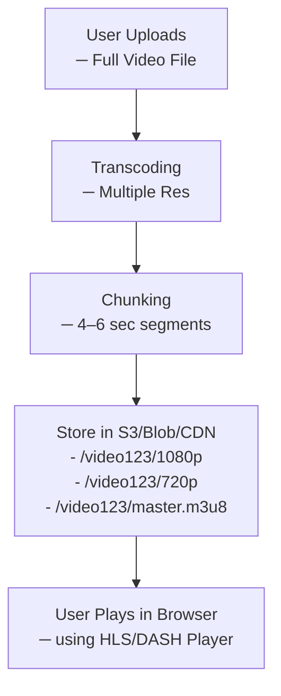

# Managed Services for Video Encoding and Chunking

## 1. AWS Elemental MediaConvert

AWS MediaConvert provides a managed solution for:

- **Transcoding** videos into multiple resolutions (360p, 480p, 720p, 1080p)
- **Creating HLS/DASH outputs** (chunks + playlists)
- **Generating thumbnails**
- **Watermarking, DRM**, and more

### How It Works

(i) **Upload** the original video to an S3 bucket.

(ii) **Create a MediaConvert job** with:

- Input S3 URL
- Output S3 path
- Output group: HLS (or DASH)

(iii) AWS automatically:

- Transcodes into different resolutions
- Chunks into `.ts` files
- Generates `.m3u8` playlists

(iv) **Host output** on CloudFront or another CDN.

---

## 2. Example Workflow with AWS MediaConvert

### Step 1: Upload Video to S3

Example path:  
`s3://my-video-bucket/uploads/video123.mp4`

### Step 2: Create MediaConvert Job

Use the AWS Console or AWS SDK/CLI.  
Specify an HLS output group and multiple resolutions:

- 1080p → 5000 kbps
- 720p → 3000 kbps
- 480p → 1500 kbps
- 360p → 800 kbps

### Step 3: Output Folder Structure (Example)

```
s3://my-video-bucket/outputs/video123/
├── 360p/
│   ├── segment0.ts
│   └── 360p.m3u8
├── 720p/
│   └── ...
├── master.m3u8   ← adaptive HLS playlist
```

### Step 4: Serve via CloudFront or S3 (Public)

Embed using HTML:

```html
<source
  src="https://cdn.myvideos.com/video123/master.m3u8"
  type="application/x-mpegURL"
/>
```

---

## Workflow Diagram



- Chunks are fetched live as needed (Adaptive Bitrate)

---

## What AWS Elemental MediaConvert Does

When you provide MediaConvert with a video file (like MP4), it:

1. **Transcodes the Video**

   - Converts to multiple resolutions (240p, 360p, 480p, 720p, 1080p, etc.)
   - Compresses using codecs like H.264 or H.265

2. **Splits into Chunks**

   - Breaks each resolution into small segments (e.g. 6-second `.ts` files for HLS or `.m4s` for DASH)

3. **Generates Playlist Files**

   - For HLS: creates `.m3u8` master + variant playlists
   - For DASH: creates `.mpd` manifest

4. **Stores All Files in S3**
   - Segments and playlists are stored in your chosen S3 bucket
