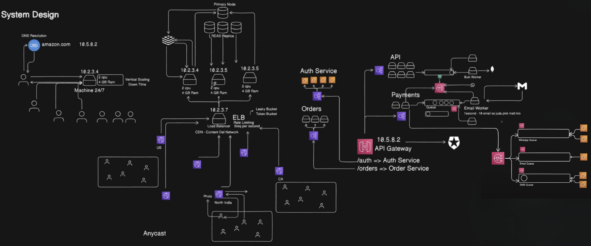
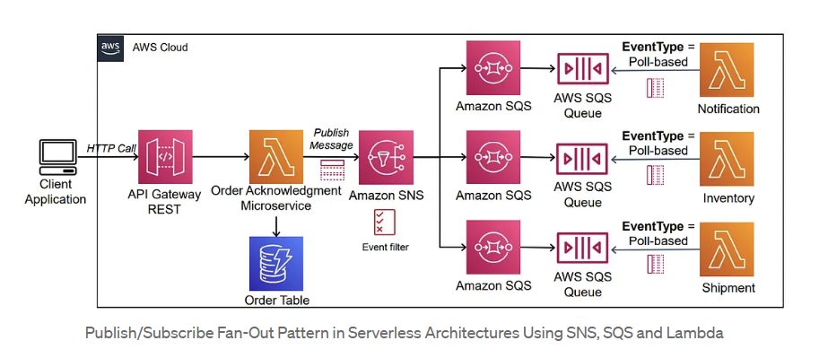
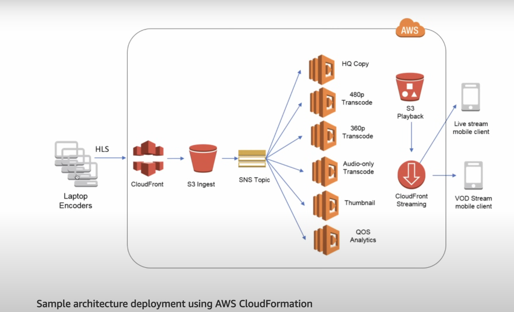

# System Design

System Design is the process of planning how to build a large-scale software system. It focuses on how different components work together to meet business and technical requirements like scalability, availability, reliability, and performance.

## System Design Overview Diagram (HLD)

### Messaging Queue

For decoupling & asynchronous operations:

- SQS(simple queue service)/Kafka → Used for:

- Media processing jobs

- Notifications (e.g., when video is done processing)

- Event tracking (for analytics)

> **Note:**  
> If a messaging queue is used directly, only one worker typically processes each event. To allow multiple workers to handle the same event, you can integrate queues with SNS (Simple Notification Service). SNS publishes the event to all subscribed queues, so each worker receives a copy. If processing fails, the event can be pushed to a Dead Letter Queue (DLQ) for retries—this is not natively available in pure pub-sub architectures, which lack acknowledgment and DLQ mechanisms.

### Load Balancer and Rate Limiting

A load balancer distributes incoming network traffic across multiple servers to ensure reliability and performance. To prevent misuse or abuse (such as DDoS attacks or excessive API calls), rate limiting can be implemented at the load balancer level.

Rate limiting restricts the number of requests a client can make in a given time window. Common algorithms include:

- **Leaky Bucket:** Processes requests at a fixed rate, smoothing out bursts.
- **Token Bucket:** Allows bursts up to a certain limit, then enforces a steady rate.

These mechanisms help protect backend services from overload and ensure fair usage among clients.

## Fan Out Architecture

Fan-out architecture is a system design pattern where a single event or task is sent (fanned out) to multiple services or workers to perform actions in parallel.

## Sns (simple notification service)

