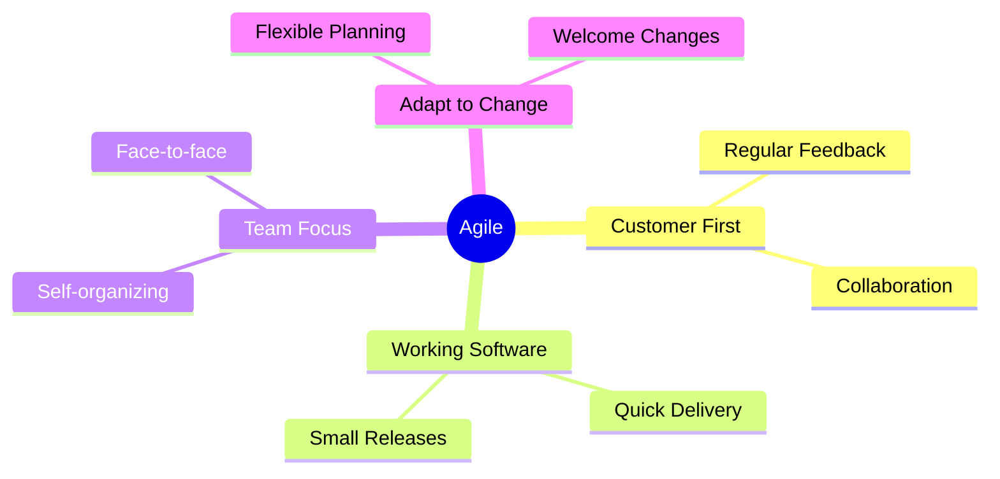
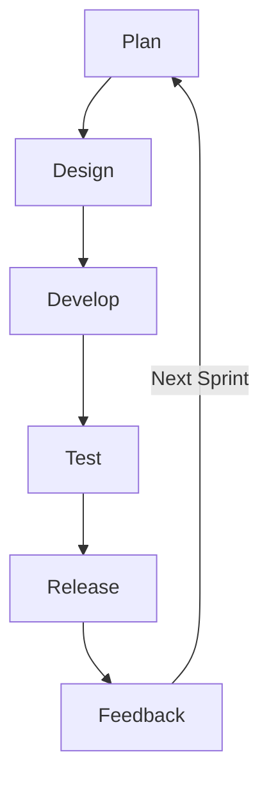
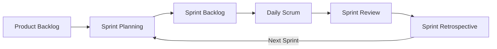
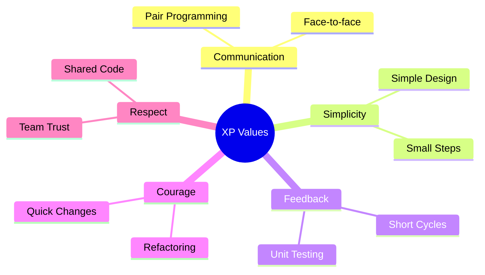
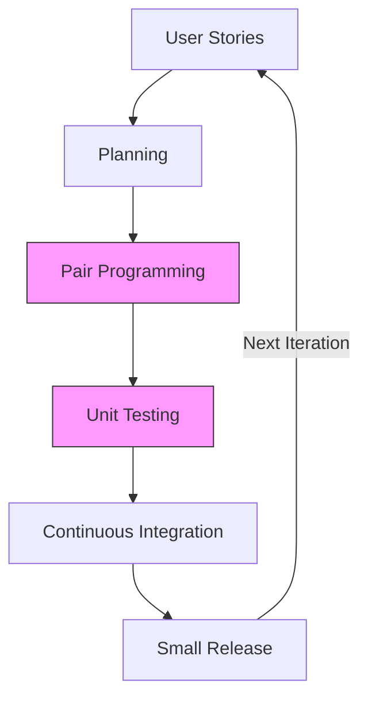

# Agile Model

## What is Agile?

Iterative approach focusing on collaboration, customer feedback, and rapid delivery.

## Core Principles

## Agile Lifecycle

## Popular Frameworks

### 1. Scrum Framework

### 2. Kanban Board

## Extreme Programming (XP)

### What is XP?

XP is an agile framework focusing on technical excellence and rapid delivery through short development cycles.

### Core Values

### XP Lifecycle

### Key Practices

#### Test-First Development

- Write tests before code
- Automated testing
- Continuous validation

#### Pair Programming

- Two developers per machine
- Code review in real-time
- Knowledge sharing

#### Continuous Integration

- Frequent code merges
- Automated builds
- Quick feedback
