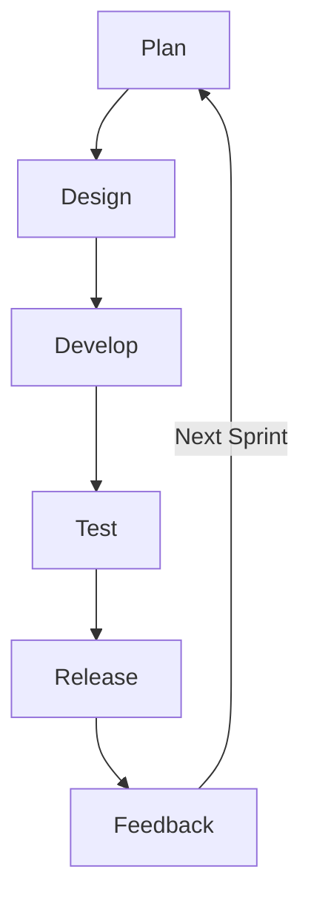
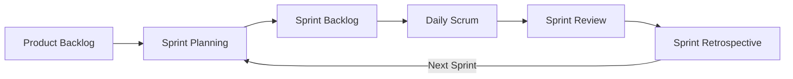
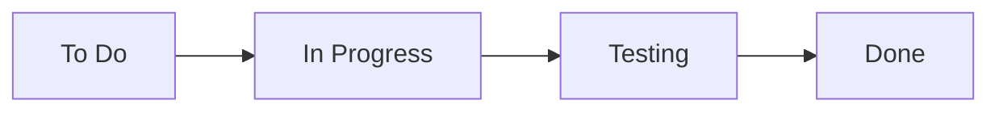
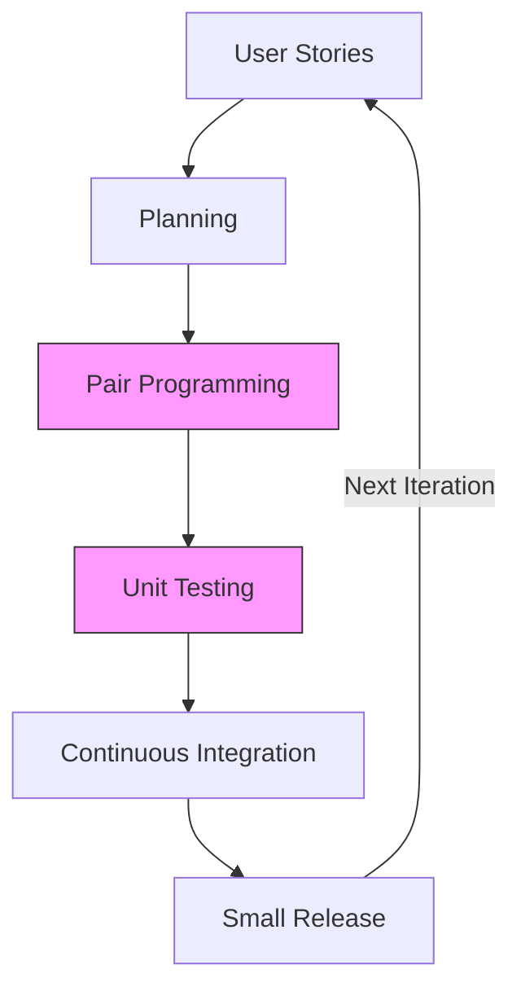

# Agile Model & Its Frameworks

## What is Agile?

The Agile Model is an iterative and incremental software development approach that emphasizes:

- Customer collaboration over contract negotiation
- Working software over documentation
- Responding to change over following a strict plan
- Continuous delivery & improvement

Unlike the Waterfall model, which follows a strict sequence, Agile is flexible, adaptive, and fast-paced.

## Phases of Agile Development

Agile follows an iterative approach, meaning the software is developed in small increments (sprints or iterations).

### 1. **Concept & Initiation**:

- Define project vision and high-level goals.
- Identify key stakeholders and set expectations.

### 2. **Planning**

- Break down requirements into user stories and prioritize them.
- Plan sprints (typically 1-4 weeks).

### 3. **Design & Development**

- Develop small working features in each sprint.
- Continuous integration and testing are done simultaneously.

### 4. **Testing & Review**

- Frequent testing ensures quality.
- Stakeholders review and provide feedback after each sprint.

### 5. **Release & Deployment**

- Each sprint delivers a working software increment to the users.
- Deployment is done continuously (CI/CD pipeline).

### 6. **Maintenance & Continuous Improvement**

- Gather feedback and improve the next sprint.
- Monitor performance and apply patches.

### Agile Lifecycle

## Agile Frameworks & Methodologies

Agile isn’t a single process but has multiple frameworks that implement Agile principles differently. Here are the most popular ones:

### 1. Scrum (Most Popular)

🔹 **Best for:** Teams working on complex projects with evolving requirements.

🔹 **Key Features:**

- Work is divided into Sprints (1-4 weeks).
- The team follows Daily Stand-up Meetings (15 min).
- Defined roles: Scrum Master, Product Owner, Development Team.
- Sprint Review & Retrospective after each sprint.

🔹 **Example Use Cases:**

- Mobile app development (WhatsApp, Instagram).
- Game development (incremental feature releases).

### Scrum Flowchart

### 2. Kanban (Visual Workflow Management)

🔹 **Best for:** Continuous delivery projects that require real-time tracking.

🔹 **Key Features:**

- Uses a Kanban Board to track work progress.
- Work items move from To Do → In Progress → Done.
- Focus on reducing bottlenecks and improving workflow efficiency.
- No fixed iterations like Scrum; work is continuously delivered.

  🔹 **Example Use Cases:**

- Customer support systems (Zendesk, ServiceNow).
- Content publishing workflows (Blogs, YouTube video releases).

### Kanban Flowchart

### 3. Extreme Programming (XP) (Code-Focused)

🔹 **Best for:** High-risk projects that require fast-paced coding & testing.

🔹 **Key Features:**

- Test-Driven Development (TDD) – Write tests before coding.
- Pair Programming – Two developers work on the same code together.
- Continuous Integration (CI) – Code is frequently merged and tested.
- Customer involvement in every sprint.

🔹 **Example Use Cases:**

- FinTech applications (real-time transactions, fraud detection).
- AI and machine learning projects (frequent model tuning).

### XP Flowchart

### 4. Lean Software Development (Speed & Efficiency)

🔹 **Best for:** Companies that focus on eliminating waste and maximizing value.

🔹 **Key Features:**

- Minimize unnecessary work (avoid extra documentation).
- Automate repetitive tasks.
- Deliver software as quickly as possible.
- Encourage team empowerment & decision-making.

🔹 **Example Use Cases:**

- E-commerce platforms (Amazon, Flipkart).
- Startups building MVPs (Minimum Viable Products).

## Comparison of Agile Frameworks

| Framework                | Best For                             | Key Features                     | Examples                            |
| ------------------------ | ------------------------------------ | -------------------------------- | ----------------------------------- |
| Scrum                    | Complex projects with evolving needs | Sprints, Stand-ups, Scrum Master | App & game development              |
| Kanban                   | Continuous workflow tracking         | Kanban Board, real-time updates  | Support teams, publishing workflows |
| XP (Extreme Programming) | Code-intensive projects              | TDD, Pair Programming, CI/CD     | FinTech, AI development             |
| Lean                     | Fast-paced delivery, efficiency      | Eliminate waste, optimize flow   | E-commerce, Startups                |

### Advantages

- Faster development cycles → Early & continuous delivery.
- Customer-focused → Frequent feedback improves quality.
- Better risk management → Issues identified early.
- Higher team collaboration → Teams work closely with stakeholders.

### Disadvantages

- Not suitable for all projects → Works poorly in highly regulated environments (e.g., medical devices).
- Requires experienced teams → Needs self-discipline & adaptability.
- Less predictability → No fixed deadlines like Waterfall.
