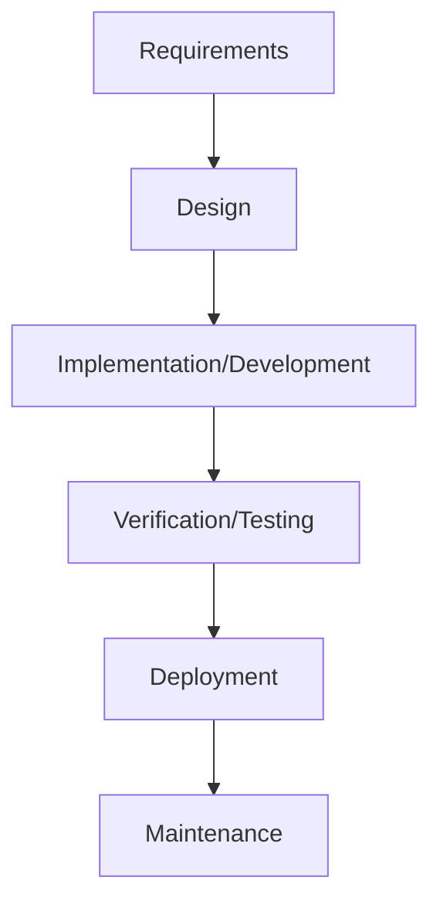
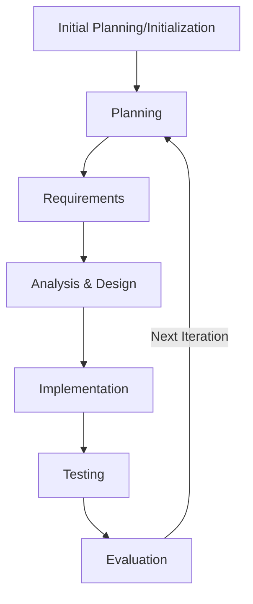
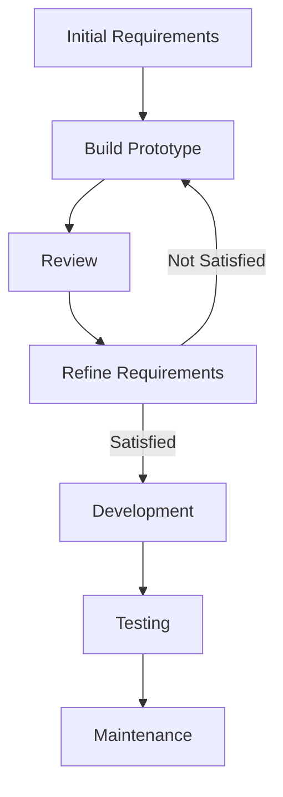
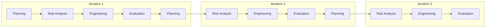
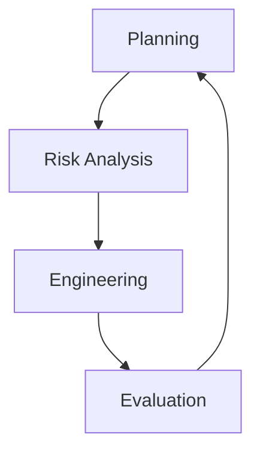
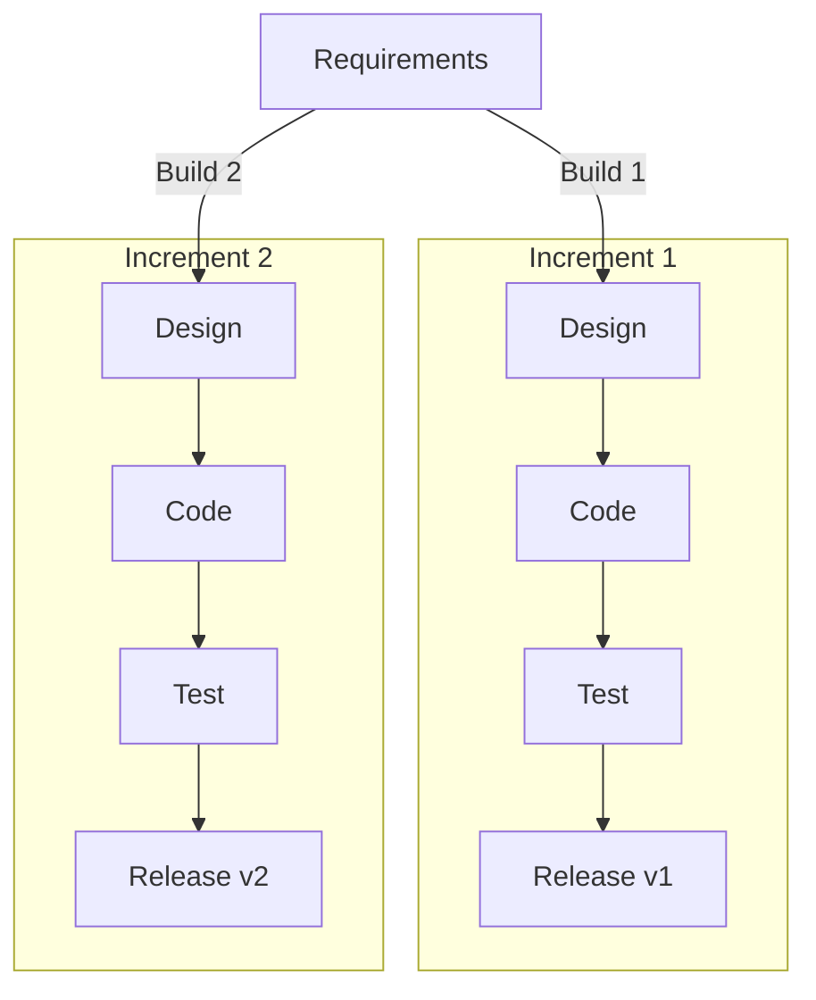
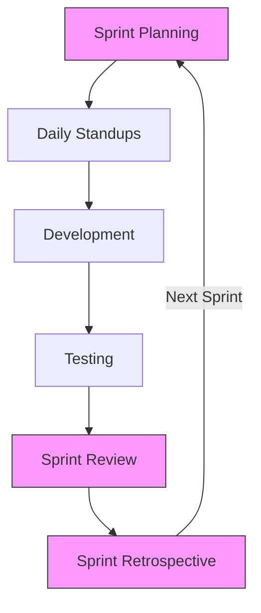

# SDLC Models

An SDLC model is a systematic approach to the software development process that defines the stages and tasks involved in building software. It serves as a guide for planning, structuring, and controlling the process of developing information systems.

## (i) Waterfall Model

- The Waterfall model follows a linear and sequential approach to software development. Each phase in the development process must be completed before moving on to the next one, resembling the downward flow of a waterfall.

Advantages

- Easy to understand and manage
- Suitable for small projects with well-defined requirements at the beginning

Disadvantages

- Inflexible to changes
- Testing happens late
- Limited client feedback
- No early prototypes

## (ii) Iterative Model

The Iterative model develops a system through repeated cycles (iterations) and in smaller portions at a time.

Advantages

- Early working version
- Flexible to changes
- Risks identified early
- Regular customer feedback
- Better risk management

Disadvantages

- More management complexity
- Needs active customer involvement
- May extend project timeline
- Documentation challenges

## (iii) V-Model (Verification and Validation Model)

The V-Model extends the waterfall model by emphasizing testing for each corresponding development stage. Each development stage has a directly associated testing phase.

- By integrating verification and validation activities in parallel, this model aims to deliver high-quality software while mitigating the risk of defects.

```mermaid
graph TD
    A[Requirements] --> F[Acceptance Testing]
    B[System Design] --> G[System Testing]
    C[Architecture Design] --> H[Integration Testing]
    D[Module Design] --> I[Module Testing]
    E[Coding]

    A --> B
    B --> C
    C --> D
    D --> E
    F --> G
    G --> H
    H --> I
    I --> E

    style A fill:#f9f,stroke:#333,stroke-width:2px
    style F fill:#f9f,stroke:#333,stroke-width:2px
    style E fill:#444,stroke:#444,stroke-width:2px
```

Advantages

- Systematic testing
- Clear deliverables
- Easy to manage
- Strong documentation

Disadvantages

- Rigid structure
- No early prototypes
- High cost of testing
- Long development cycle

## (iv) Evolutionary Models

- Evolutionary Models are iterative.

## 1. Prototyping Model

A software development model where a prototype is built, tested, and refined until it meets client requirements.

Best Used For

- User interface designs
- Online systems
- Web applications
- Mobile apps

Advantages

- Early user feedback
- Clear requirements
- Reduced risk
- Better user satisfaction

Disadvantages

- Time-consuming
- Increased cost
- Client confusion
- Incomplete documentation

## 2. Spiral Model

The Spiral Model combines aspects of both waterfall and prototyping models, emphasizing risk analysis throughout each iteration.

- continuous iteration of the above step....

---

Four Phases per Spiral

- Planning :
  Objectives,
  Alternatives,
  Constraints,
  Risk Analysis

- Identify risks:
  Risk mitigation,
  Prototyping,
  Engineering

- Development:
  Testing,
  Verification,
- Evaluation:
  Review results,
  Plan next iteration,
  Decision to continue

---

Best Used For:

- Large, high-risk projects
- Projects needing early user feedback
- Complex systems with unclear requirements Example: New Operating System Development

---

Advantages

- High risk management
- Early prototypes
- Flexible to changes
- Regular customer feedback

  Disadvantages

- Complex management
- High documentation
- Expensive for small projects
- Needs risk assessment expertise

## (v) Incremental Model

Develops software in increments, with each increment adding new functionality to the previous version.

### Development Cycle

Key Features

- Multiple Development Cycles
- Partial Systems
- Prioritized Development
- Parallel Development

Advantages

- Early functional software
- Flexible scheduling
- Easy to test
- Risk management

Disadvantages

- Interface challenges
- Need good planning
- System architecture issues
- Documentation overhead

## (vi) Agile Model

Agile is an iterative approach that focuses on collaboration, customer feedback, and rapid releases.

### Sprint Cycle

