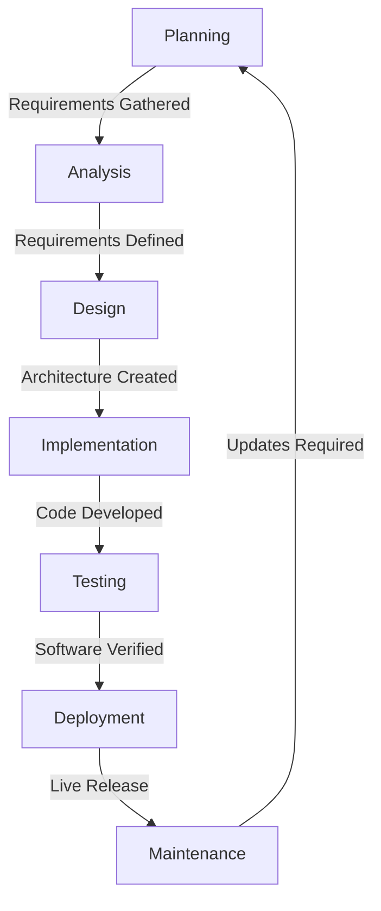
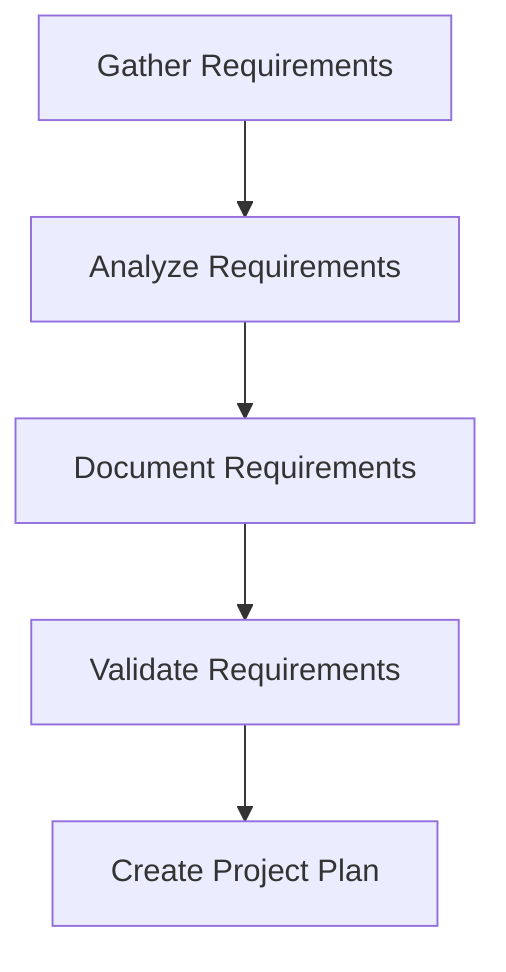
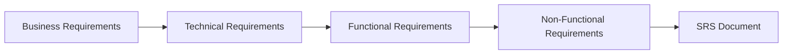
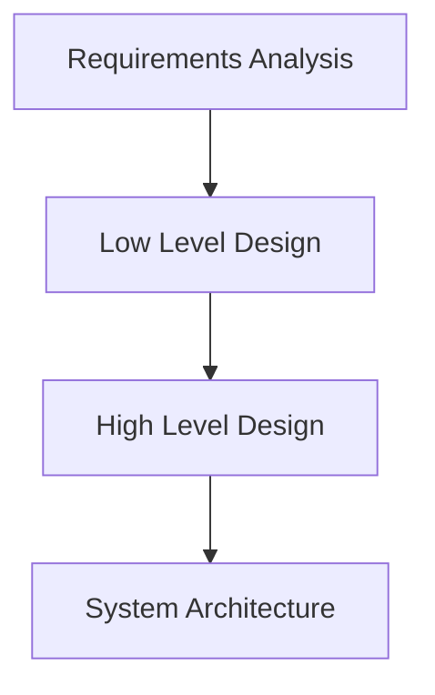
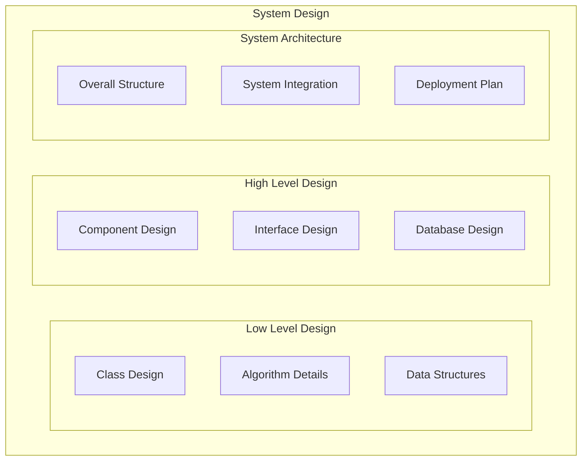
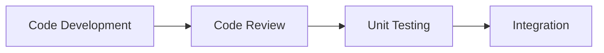
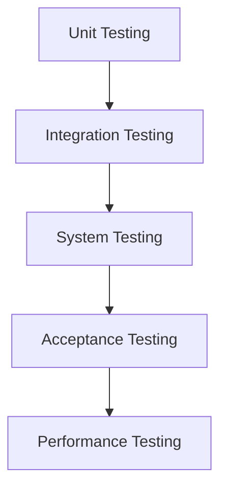
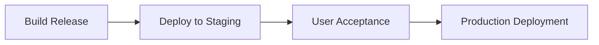
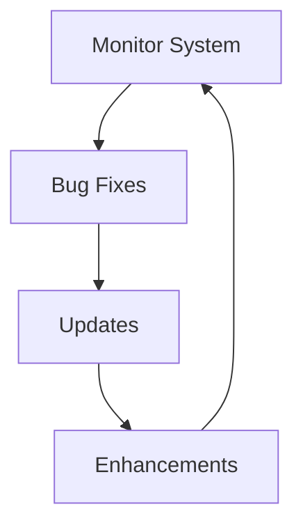

# Software Development Life Cycle (SDLC)

## What is SDLC?

The Software Development Life Cycle (SDLC) is a systematic process for building software applications that ensures their quality and correctness. The SDLC process aims to produce high-quality software that meets customer expectations and completes development within time and cost estimates.

## Key Objectives

- Deliver high-quality software
- Meet customer expectations
- Complete within timeline and budget
- Follow best practices and standards

## SDLC Stages

## 1. Planning and Requirement Analysis

## 2. Defining Requirements

- This is fulfilled by utilizing SRS (Software Requirement Specification). This is a sort of document that specifies all those things that need to be defined and created during the entire project cycle.

## 3. System Design

### Two approaches to System Design:

1. **Top-Down Approach** (High Level → Low Level)

   - Start with overall system architecture
   - Break down into smaller components
   - Good for understanding big picture first

2. **Bottom-Up Approach** (Low Level → High Level)
   - Start with detailed components
   - Combine into larger systems
   - Good for understanding implementation details first

### Design Hierarchy:

- SRS is a reference for software designers to come up with the best architecture for the software. Hence, with the requirements defined in SRS, multiple designs for the product architecture are present in the Design Document Specification (DDS).

## 4. Implementation

- At this stage, the fundamental development of the product starts. For this, developers use a specific programming code as per the design in the DDS.
- Programming tools like compilers, interpreters, debuggers, etc. and languages like C/C++, Python, Java etc. are also put into use at this stage.

## 5. Testing and Integration

## 6. Deployment

## 7. Maintenance

Reference: [Click here](https://www.geeksforgeeks.org/sdlc-models-types-phases-use/?ref=lbp)
